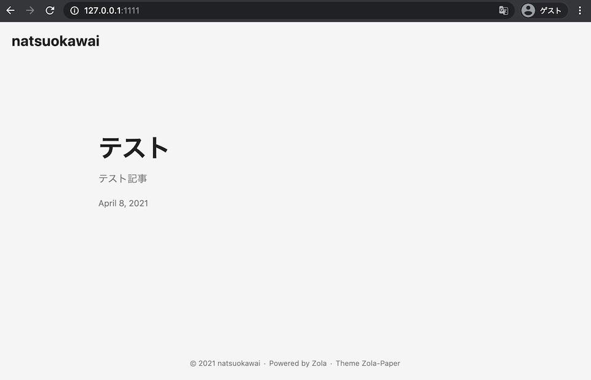
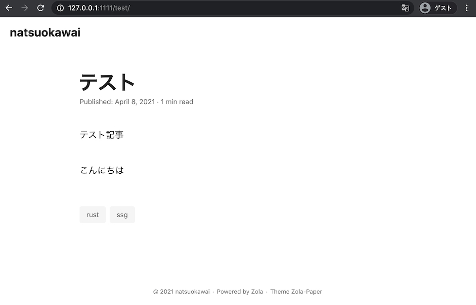

+++
title = "Rust 製静的サイトジェネレーター Zola でブログを構築する"
date = 2021-04-08

[extra]
author = "natsuokawai"

[taxonomies]
tags = ["rust", "ssg"]
+++

Rust で書かれている静的サイトジェネレーターである [Zola](https://www.getzola.org/) を使ってブログを作ったのでその手順をメモしておく。  

<!-- more --> 


## Zola プロジェクトを作成する
まずは Zola をインストールする。私は Mac を使っているので brew で入れた。  
その他の環境の場合は[こちら](https://www.getzola.org/documentation/getting-started/installation/)を参照。  

```sh
$ brew install zola
$ zola --version
zola 0.13.0
```

次に、`zola init` コマンドを使ってプロジェクトを開始する。  
GitHub Pages で公開したいのでプロジェクト名はここでは `<username>.github.io` にしておく。

```sh
$ zola init "natsuokawai.github.io"
Welcome to Zola!
Please answer a few questions to get started quickly.
Any choices made can be changed by modifying the `config.toml` file later.
> What is the URL of your site? (https://example.com): 
> Do you want to enable Sass compilation? [Y/n]: 
> Do you want to enable syntax highlighting? [y/N]: 
> Do you want to build a search index of the content? [y/N]: 

Done! Your site was created in /path/to/natsuokawai.github.io

Get started by moving into the directory and using the built-in server: `zola serve`
Visit https://www.getzola.org for the full documentation.
```

対話形式で URL など聞かれるが、後で簡単に変えられるのでとりえあずすべてデフォルト値で。  
プロジェクトディレクトリ（`<username>.github.io`）に移動し、`zola serve` コマンドでローカルサーバーが立ち上がる。  
ブラウザで `http://127.0.0.1:1111/` にアクセスすると "Welcome to Zola!" というページが表示される。  

## テーマを設定する
この後テンプレートなどを編集して自分好みのサイトを作ることもできるが、今回は[公式のテーマ一覧ページ](https://www.getzola.org/themes/)からテーマを探してきて、 `Zola-paper`（このブログでも使っているテーマ）を使うことにした。  

```sh
$ cd themes
$ git clone https://github.com/schoenenberg/zola-paper.git
```

ダウンロードしたテーマを `config.toml` で指定することでスタイルが反映される。  

```toml
theme = "zola-paper"

[markdown]
```

テーマ設定はこれで完了。

### config.toml の設定
theme の他にも色々と設定できる項目があり、一旦以下のように編集した。  

```toml
base_url = "https://natsuokawai.github.io"

title = "natsuokawai"

compile_sass = true

theme = "zola-paper"

generate_feed = true

taxonomies = [ 
    {name = "tags", rss = true, paginate_by = 5}, 
]

[markdown]
highlight_code = true

highlight_theme = "material-dark"

[extra]

```

taxonomies の設定は zola-paper の config.toml から引っ張ってきた。  
その他の設定項目については[こちら](https://www.getzola.org/documentation/content/section/#front-matter)から。  


## 記事の作成
まず、一覧ページのテンプレートとなる `_index.md` を content 配下に作成する。  
`+++` で囲った中にメタ情報を記述する。  

```
+++
sort_by = "date"
paginate_by = 5 
+++
```

個々の記事についても `content/` 配下に作成する。  
このとき、`foo.md` とするとウェブサイト上のパスが `/foo` になり、`foo/bar.md` といったようにディレクトリをネストすると `foo/bar` となる。  

`content/test.md` というファイルを作ってみる。  

```md
+++
title = "テスト"
date = 2021-04-08

[extra]
author = "natsuokawai"

[taxonomies]
tags = ["rust", "ssg"]
+++

テスト記事

<!-- more -->

こんちには
```

`_index.md` と同じように `+++` の中にメタ情報を記述する。タグも利用できて便利。  


また本文に `<!-- more -->` という要素も必要で、これは記事が一覧表示のトップになったときにどこまで表示するかを制御できる。  

これでトップページを表示してみる。  



記事タイトルをクリックすると詳細ページに飛び、`<!-- more -->` より下の部分も表示される。  



これでローカルでのブログ開発は可能になった。  
GitHub Pages での公開手順はまたいつか。  
